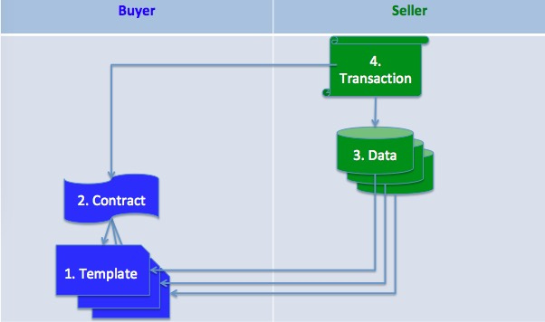

# General design

## Big picture
The data exchange system has following key concepts:
1. template
2. data
3. contract
4. transaction
5. buyer
6. seller

the relationship is as flows:  


## file format
### template
TBD

### data
TBD

### contract
TBD

### transaction
TBD

## Data exchange
Since we must identyfy who send what and how to prove it, so we must attach sender's identiy and signature

We have two kinds of data to be post:</br>
1. Plain Data 
2. Encrypted Data 

### Plain Data Exchange
For plain data, if data assumed to be upload is:
```
	{
		"type":"template",
		"tid":"FW2018071602",
		"category":"general",
		"template":[
			{"name":"Patientname",
			"alias":"姓名",
			"DID":1,
			"type":"string",
			"required":true
			},
		]
	}
```

So the data we send may be:
```
{
	"sender":"886812acdf2...",
	"data":'{
		"type":"template",
		"tid":"FW2018071602",
		"category":"general",
		"template":[
			{"name":"Patientname",
			"alias":"姓名",
			"DID":1,
			"type":"string",
			"required":true
			},
			]
		}',
	"sig":"9012387t5121..."
}
```
### Encrypt Data Exchange
Suppose the data to be encrypted is:
```
{
        "type":"data",
	"encode":"plain",
        "tid":"FW2018071601",
        "data":[
                {
			"DID":1,
                	"value":12.98
                },  
                {
			"DID":2,
                	"value":4.64
                },  
                {
                	"DID":3,
                	"value":123
                }
        ]
}
```

and the data seded will be:
```
{
	"sender":"886812acdf2...",
	"data":"75969569870806",
	"sig":"9012387t5121..."
}
```

## Data encrypt and Decrypt
All data is encrypted with a symmetric cryptography, such as AES.  
Since the **data** is from the seller, and should be read by the buyer after the transaction, so the seller first encrypted data with AES using a random key(**smk**): .
The symmetric is encrypted with the buyer's pubic key(**pbk**) and can only be deciphered by the buyer's private key().  
So the encrypted key  is in the transaction payload, along with the fee transfered as a atomic transaction.

